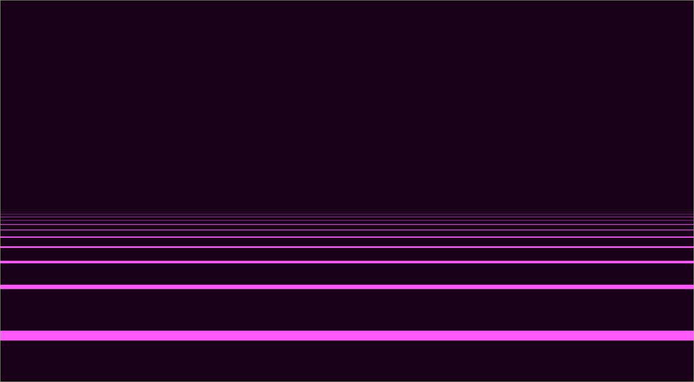

# XScreensaver WGPU
An experiment to see if it's possible to write an xscreensaver in rust and wgpu.

## References
* https://github.com/rkday/50-short-programs-in-rust/tree/master/xscreensaver-game-of-life
* https://sotrh.github.io/learn-wgpu/

## State
Dirty, Messy, WIP

## Screenshot

